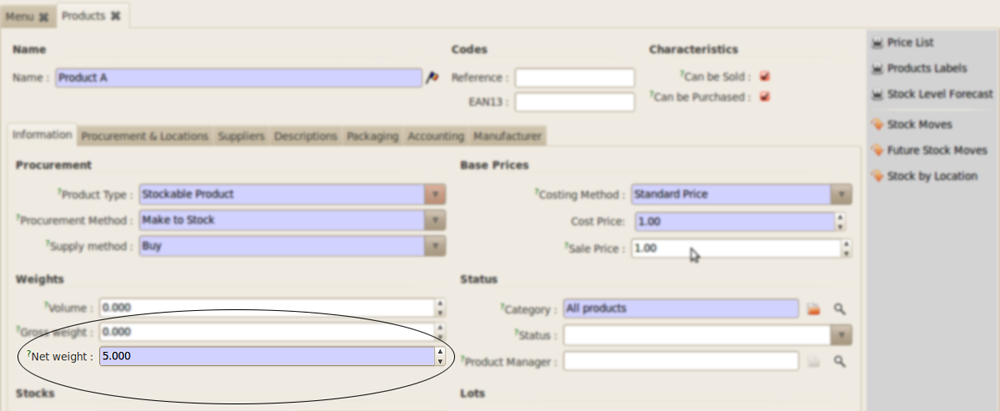
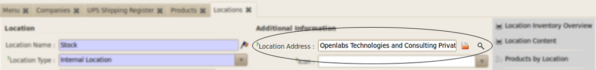
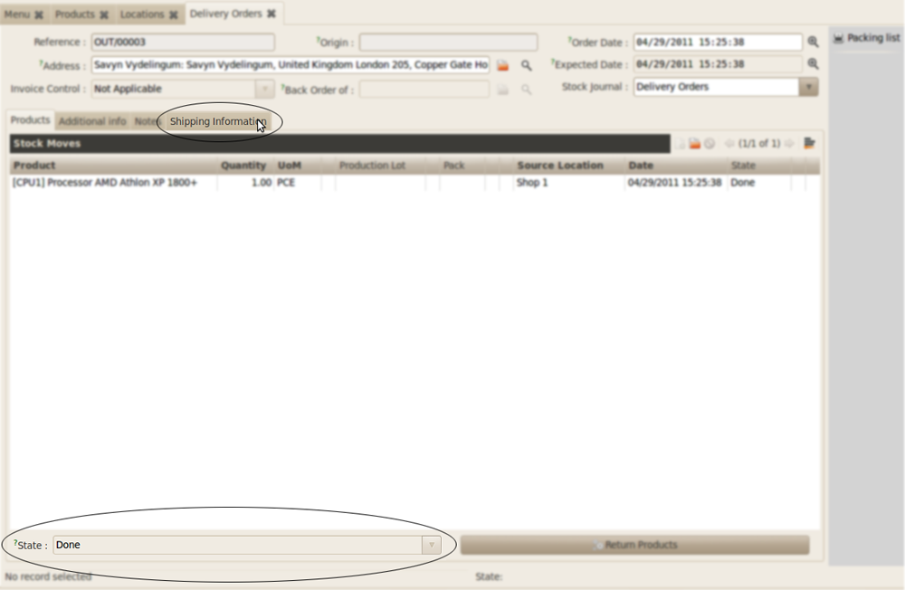
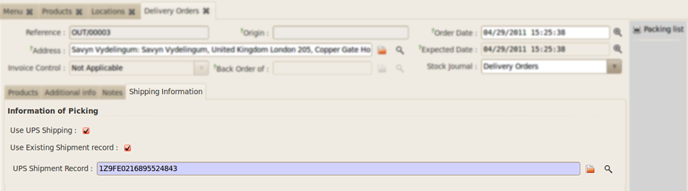
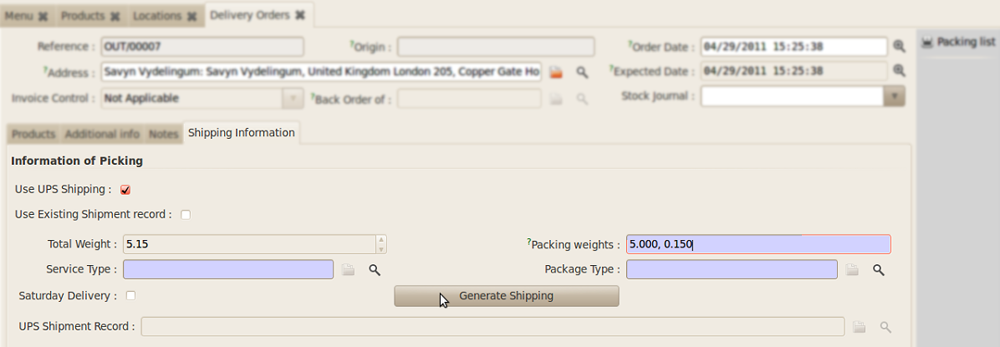
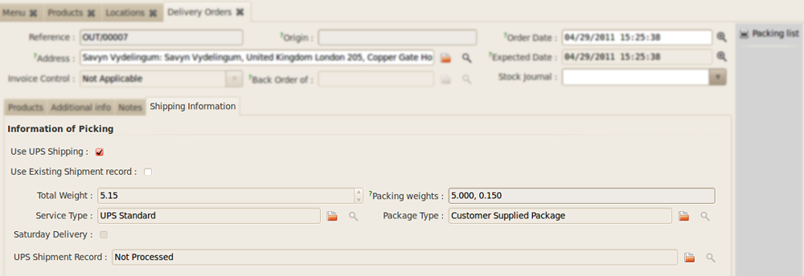

Stock Integrated Shipping Client
********************************

The module is tightly integrated with Stock Picking of OpenERP. However before 
using it with shippping some Pre-Configuration needs to be done. Here the
pre-configuration is defined inside the topic Simple Notes.

Simple Notes
============

All products must have Net Weight now. Prior to the installation of this
module Net Weights were not manadatory.

   **Sample Product Screen** : Here it is shown that the ``Net Weight`` field
   is manadatory.

    
   **Setting address to Stock Location**: The Location address needs to be
   set to the stock location. To set the address go to *Warehouse >>
   Configuration >> Warehouse Management >> Location*.
    

Using with Stock Picking
========================

The Stock Picking screen will now show an extra tab for shipping information 
after products are selected and state of the picking is **Done** as shown in
the figure below.

   *Stock Picking with Shipping Information tab*

Now there are two options to proceed further:

**Option 1**: Select an already created Shipping record (in the Standalone
Mode) to the picking

   **Associating with existing Shipping Record**: To proceed with an
   existing shipping record, e.g. the record created for the Standalone
   Shipping Client, Select the option ``Use Existing Shipping Record``.

**Option 2**: Or choose to create a new Shipping Record from the Pre-Filled data 
in the stock move.

   **Generating new shipping from Stock Picking Information** : Untick the
   option ``Use Existing Shipping Record`` to create a new shipping.
    
1. ``Packing Weights``: Packing weights indicate the various packings you may 
   have in the shipment. For example you may decide to ship a packet of 15 Kgs 
   in two packs of 10 and 5 each or 7 and 8 each. You can indicate your weights 
   by seperating them by commas as shown in the figure. By default the weight 
   is automatically computed and packs are created for each line in the picking.
   
2. ``Service Type``: Some service types are defined for UPS services, e.g.
   `USP Standard`. Select the one most suitable to you.
   
3. ``Package Type``: The package types are defined in this section, e.g.
   `Customer Supplied Package`.

On clicking *Generate Shipping* a new shipping record is created 
(just as with the standalone mode). The created record can be seen in the field 
for 'UPS Shipping Register'. And clicking the Folder Icon opens the Resource.

The created Shipping Record is in the Draft stage and is not confirmed.

It can be confirmed by clicking 'Request' then 'Accept', which generates the 
label.

The screenshots are below:

   *Final screen of Stock after Generation of picking*
