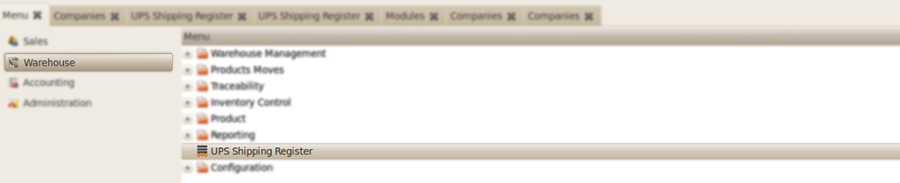
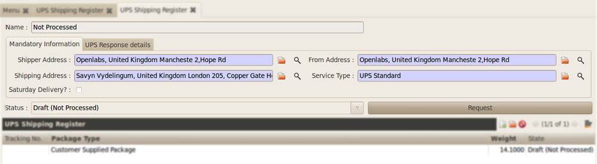
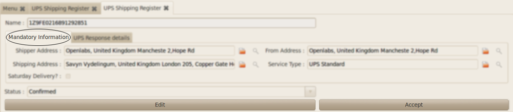
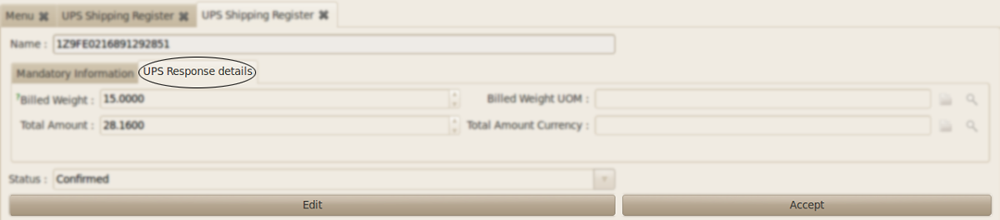
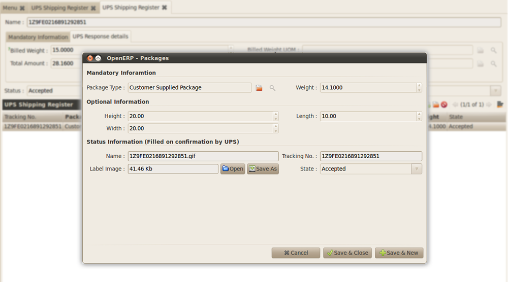
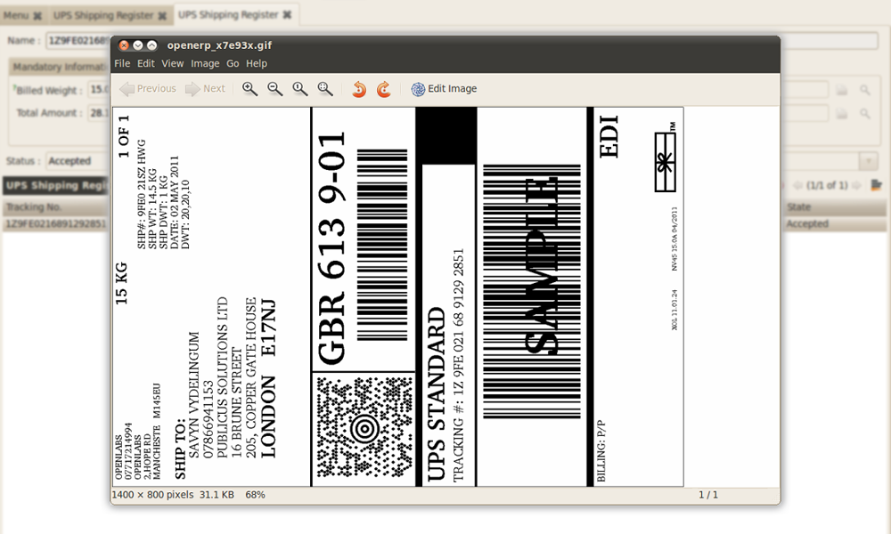

Standalone Shipping Client
##########################

In the Standalone usage you can create custom shipments using the OpenERP 
interface. To access this functionality open *Warehouse >> UPS* Shipping Register.

   **Standalone Mode Menu**

    
    **Example in Standalone Mode** : This figure shows how a new package is
    created. The fields are explained as below:   

    * ``Shipper Address`` : The address of the Shipper
    * ``Shipping Address`` : The shipping address to which the product has to be
      delivered.
    * ``From Address`` : The address from where the shipping has to be done.
    * ``Service Type`` : The Service Type

After providing the necessary information, click on **Request**. Billed
weight and total amount will be fetched from UPS. 

    
    **Confirmed Shipping Awaiting Acceptance**

   **Billed Weight & Amount from UPS** : Now go to ``UPS Response Details`` tab
   to view the *Billed Weight*, *Total Amount* etc.

Click on **Accept** in the ``UPS Response Details`` tab. A new record
will be created in the `UPS Shipping Register`. Double click the newly
generated record.

    
   **Tracking Number** : As the record is selected a new dialog box **OpenERP -
   Packages** will pop-up. From this Output the label can be downloaded.
   Click on **Open** to view the label.

    
   **Shipping Label** : The label will open in your preferred image viewer.

