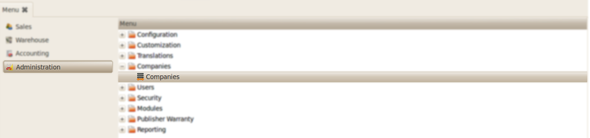
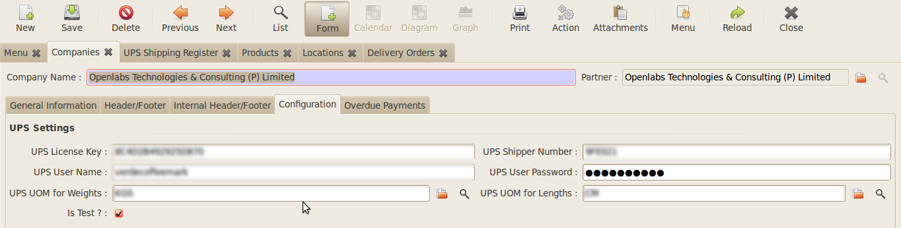

UPS Shipping
############

Introduction
------------

The **UPS shipping** module lets you to integrate its shipping functionality
directly in to OpenERP. The module streamlines all your shipping with no
additional expenses for either software or hardware and giving access to
multiple UPS services

Configuration
-------------

The module requires certain initial configuration to be done to set the API
username and password.

   *Configuration of Company menu*

Go to *Administration >> Companies* and select the company.

   
   *Setting the API*

Now in the form view of the company select the ``Configuration`` tab.
Set the UPS License Key, Shipper Number, UPS User-Name, UPS User Password.
Tick the ``Is Test`` and fill the UOM Weights, Length field for
configuration.

The fields/UPS credentials are explained as below:

* ``UPS License Key`` : The License Key related to the account
* ``Shipper Number`` : The Shipper Number provided
* ``UPS User-Name`` : UserName of UPS account
* ``UPS User Password`` : Password of the UPS account

The Module is designed to work as both a Standalone UPS Shipping and with the 
Stock Module. The working of two modules is explained in the next topic.

